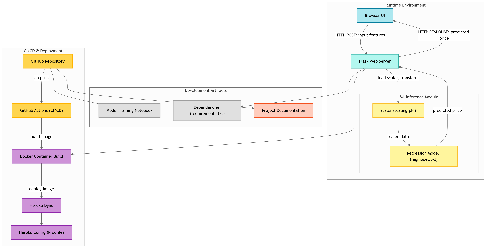

# House Pricing Prediction Model

This project aims to develop a robust and accurate model for predicting house prices based on various features. The model leverages machine learning techniques to provide valuable insights into the housing market, enabling users to estimate the fair market value of properties. This tool can be used by real estate agents, potential buyers, and investors to make informed decisions.

>Project Workflow



## Software and Tools Requirements

1.  **GitHub Account:** Required for version control and collaboration. Sign up at [GitHub](https://github.com).
2.  **Heroku Account:** Required for deploying the model as a web application. Sign up at [Heroku](https://heroku.com).
3.  **VS Code IDE:** Recommended Integrated Development Environment for code editing and project management. Download at [VS Code](https://code.visualstudio.com/download).
4.  **Python:** Version 3.11 or higher is recommended. Download from [Python Official Website](https://www.python.org/downloads/).
5.  **Pip:** Python package installer. Usually comes with Python installations. Ensure it is updated:

    bash
    python3 -m venv myenv
    bash
    pip install -r requirements.txt
        *   **Troubleshooting:** If you face issues like `ModuleNotFoundError`, double-check that your virtual environment is activated and that you've installed all the dependencies correctly.  If you get permission errors, try running the installation with `--user` flag (e.g., `pip install --user -r requirements.txt`).

## Project Structure

## Data

The model was trained on the *California Housing Dataset*, which includes features such as square footage, number of bedrooms, location, and other relevant characteristics.  The dataset is located in `sklearn datasets`. The dataset was preprocessed to handle missing values, outliers, and categorical variables. One of the prprocessing steps includes **Scaling** the data to provide a `Standardization/Normalization` of the data as Linear Regression works best on Normalized data.

## Model Architecture

The prediction model is based on a `Linear Regression` algorithm.

*   **Features:** *MedInc*,	*HouseAge*,	*AveRooms*,	*AveBedrms*, *Population*,	*AveOccup*,	*Latitude*,	*Longitude*.
*   **Hyperparameters:** No such specific hyperparameter used. 

## Training Process

The model was trained using a 80/20 train/test split approach.

## Evaluation Metrics

The model's performance was evaluated using the following metrics:

*   **Mean Squared Error (MSE):**  Measures the average squared difference between predicted and actual values.
*   **R-squared (R²):**  Represents the proportion of variance in the dependent variable that can be predicted from the independent variables.

> The R² score was found to be 61.08% and the MSE and MAE were 52.69%. These metrics could be bettered using the **L1 and L2 Regularisations (Ridge and Lasso Regressions)**

## Dependencies

The project relies on the following Python packages:

*   **Flask:** For creating the web application.
*   **Scikit-learn:** For machine learning tasks.
*   **Pandas:** For data manipulation and analysis.
*   **NumPy:** For numerical computations.
*   **Gunicorn:** For serving the Flask application in production.

These dependencies are listed in the `requirements.txt` file.

## Usage Instructions

1.  **Running the Model Locally:**
```
bash
python app.py
```
    *   Open your web browser and go to `http://127.0.0.1:5000` to access the prediction model.

2.  **Making Predictions:**

    *   Enter the required features in the input fields on the web page.
    *   Click the "Predict" button to get the predicted house price.

## Deployment to Heroku

1.  **Create a Heroku App:**

    *   Log in to your Heroku account.
    *   Create a new app through the Heroku dashboard.

2.  **Set up Git Repository:**

    *   Initialize a Git repository in your project directory.
            *   Push your code to Heroku.

            *   Once the deployment is complete, you can access your app through the URL provided by Heroku.

## Contribution Guidelines

We welcome contributions to improve this project!  Here are some guidelines:

bash
    git checkout -b feature/your-feature-name
    6.  **Create a Pull Request:** Submit a pull request to the main repository.

> Please ensure your code follows the project's coding style and includes appropriate documentation and tests.

## License

Apache MIT 2.0 License